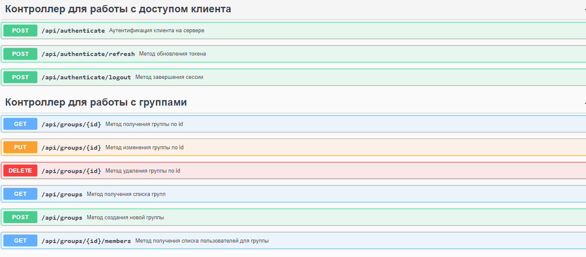

#### Приложение - клиент для работы с Keycloak

Back-end часть клиентского приложения для управления ресукрсами Keycloak.
Авторизация и аутентификация клиента в системе, управление элементами системы системы: группы, пользователи.

Реализованы методы: 
- аутентификации пользователя, обновления токена, завершения сессии.
- поиск групп/группы, поиск пользователей состоящих в группе, удаление группы.

*Для просмотра всех эндпоинтов и удобства тестирования добавлен Swagger (доступен на localhost:8088/swagger-ui/index.
html#)*

