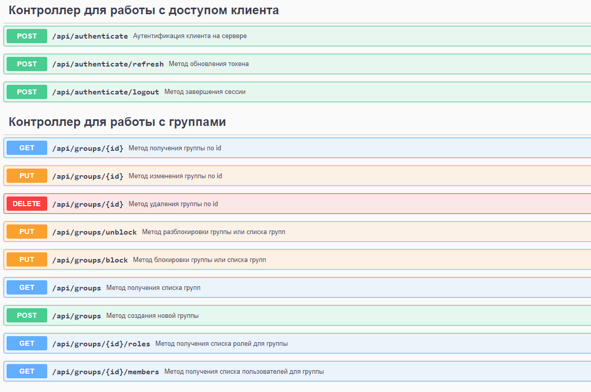

#### Приложение - клиент для работы с Keycloak

Реализованы методы аутентификации пользователя, обновления токена, завершения сессии.

*Для просмотра всех эндпоинтов и удобства тестирования добавлен Swagger (доступен на localhost:8088/swagger-ui/index.
html#)*

